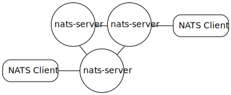
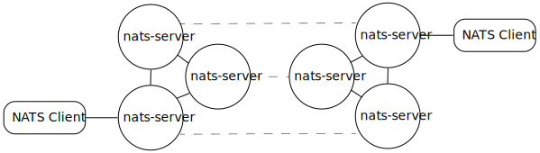
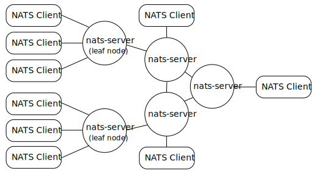

# NATS Adaptive Deployment Architectures

From a single process to a global super-cluster with leaf node servers, you can always adapt your NATS service deployment to your needs. From servers and VPCs in many clouds, to partially connected small edge devices and everything in between, you can always easily extend and scale your NATS service as your needs grow.

## A single server

The simplest version of a NATS service infrastructure is a single `nats-server` process. The `nats-server` binary is highly optimized, very lightweight and extremely efficient in its resources' usage.

Client applications establish a connection to the URL of that nats-server process (e.g. `"nats://localhost"`).

## A cluster of servers

If you need a fault-tolerant NATS service or if you need to scale your service capacity, you can cluster a set of nats-server processes together in a cluster.

Client applications establish and maintain a connection to (one of) the nats server URL(s) composing the cluster (e.g. `"nats://server1","nats://server2",...`).

## A super-cluster

You can go further than a single cluster and have disaster recovery and get global deployments (e.g. on multiple locations or regions, multiple VPCs or multiple Cloud providers) by deploying multiple clusters and connecting them together via gateway connections (which are interest pruned).

Client applications establish a connection to (one of) the nats server URL(s) of one of the clusters (e.g. `"nats://us-west-1.company.com","nats://us-west-2.company.com",...`).

## With Leaf Nodes

You can easily 'extend' the NATS service provided by a cluster or super-cluster by deploying 'locally' one or more **leaf node** nats servers that proxy and route traffic between their client applications and the NATS service infrastructure. The context of 'locality' in this case is not just physical: it could mean a location, an edge device or a single development machine, but it could also service a VPC, a group of server processes for a specific application or different accounts, or even a business unit. Leaf node NATS servers can be configured to connect to their cluster over a WebSocket connection (rather than TLS or plain TCP).

Leaf nodes appear to the cluster as a single account connection. Leaf nodes can provide continuous NATS service for their clients, even while being temporarily disconnected from the cluster(s). You can even enable JetStream on the leaf nodes in order to create local streams that are mirrored (mirroring is store and forward and therefore can recover from connectivity outages) to global streams in the upstream cluster(s).

Client applications are configured with the URLs of their 'local' leaf node server(s) and establish a connection to (one of) the leaf node server(s) (e.g. `"nats://leaf-node-1","nats://leaf-node-2",...`).

## See Also

NATS Service Geo-affinity in Queues&#x20;


Geo-affinity in Queues

