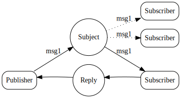

# Request-Reply

Request-Reply is a common pattern in modern distributed systems. A request is sent, and the application either waits on the response with a certain timeout, or receives a response asynchronously.

The increased complexity of modern systems necessitates features like [location transparency](https://en.wikipedia.org/wiki/Location\_transparency), scale-up and scale-down, observability (measuring a system's state based on the data it generates) and more. In order to implement this feature-set, various other technologies needed to incorporate additional components, sidecars (processes or services that support the primary application) and proxies. NATS on the other hand, implemented Request-Reply much more easily.

### NATS makes Request-Reply simple and powerful

* NATS supports the Request-Reply pattern using its core communication mechanism — publish and subscribe. A request is published on a given subject using a reply subject. Responders listen on that subject and send responses to the reply subject. Reply subjects are called "**inbox**". These are unique subjects that are dynamically directed back to the requester, regardless of the location of either party.
* Multiple NATS responders can form dynamic queue groups. Therefore, it's not necessary to manually add or remove subscribers from the group for them to start or stop being distributed messages. It’s done automatically. This allows responders to scale up or down as per demand.
* NATS applications "drain before exiting" (processing buffered messages before closing the connection). This allows the applications to scale down without dropping requests.
* Since NATS is based on publish-subscribe, observability is as simple as running another application that can view requests and responses to measure latency, watch for anomalies, direct scalability and more.
* The power of NATS even allows multiple responses, where the first response is utilized and the system efficiently discards the additional ones. This allows for a sophisticated pattern to have multiple responders, reduce response latency and jitter.

### The pattern



Try NATS request-reply on your own, using a live server by walking through the [request-reply walkthrough.](reqreply\_walkthrough.md)

### No responders

When a request is sent to a subject that has no subscribers, it can be convenient to know about it right away. For this use-case, a NATS client can [opt-into no\_responder messages](../../../reference/nats-protocol/nats-protocol/#syntax-1). This requires a server and client that support headers. When enabled, a request sent to a subject with no subscribers will immediately receive a reply that has no body, and a `503` status.

Most clients will represent this case by raising or returning an error. For example:

```go
m, err := nc.Request("foo", nil, time.Second);
# err == nats.ErrNoResponders
```
