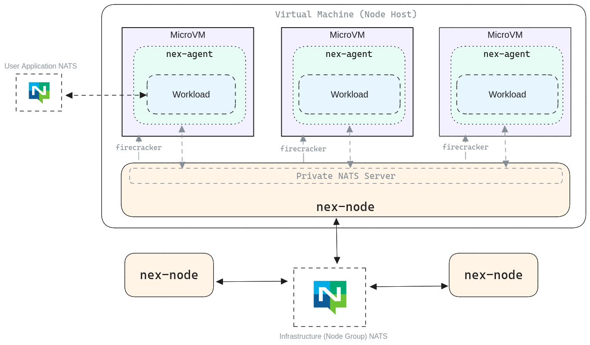

# Nex System Architecture
While the vast majority of the functionality of Nex can be found inside the single `nex` binary, Nex is actually a suite of tools and components that all collaborate to give you the power to deploy and manage workloads using your existing NATS infrastructure.

## Architecture Overview
The following diagram provides an illustration of the Nex system architecture and how all of the various componenents interoperate. It might seem a bit daunting at first, so we'll cover each part of the diagram in detail next.

## Workload NATS vs Control NATS
Before we even get into discussing the various components, there's some context we need to provide first. Quite possibly one of the most important concepts to understand is the distinction between the NATS system used by a workload and the NATS system used by Nex. It is crucial to understand this in order to properly (and securely) configure your systems for use in production.

### Workload NATS
The connection(s) used by workloads are just that. If you're taking pre-existing services and deploying them to Nex, then you'll know that these workloads need their own NATS connections and, depending on the application, often have very specific connection and security requirements.

In most applications like this, especially those inspired by the [12 factor](https://12factor.net/config) guidelines, your code gets its connection data from environment configuration. For example, it might pick up the server URL(s) from the `NATS_SERVER` environment variable.

This connection stays the same whether the code is running within or outside of Nex.

The situation is easy for services because they rely on environment variables and, most importantly, are allowed to create their own connections to NATS servers (within the constraints of CNI configuration).

Functions play a more passive role in their NATS connection. Rather than creating their own NATS connections, they rely on [host services](../host_services/readme.md) provided by the Nex node to communicate with limited NATS resources such as key-value and object store buckets and publication subjects. This connection is also dictated by the initial parameters to the workload deployment.

### Control NATS
All Nex nodes are remotely controllable. This is the key to the imperative-style control that we've mentioned a few times. When a Nex node is brought up, it requires a NATS connection. This connection is exclusively for command and control operations. As such, when you're planning on how to structure accounts, signing keys, and operators, you should keep this in mind. Even though Nex is quite secure, you still don't want untrusted code to have unfettered access to control connections.

All control operations take place on a topic namespace that starts with the `$NEX` prefix, making it easy to isolate and control access.


Unless you're running in a test or development environment, the connections used by workloads should never overlap with connections used by the control interface. You don't necessarily need private servers, but you should be able to guarantee traffic isolation.


## Nex Components
There are a number of key Nex components contained in the preceding diagram, and each is discussed in detail in this section.

* [Node Process](./node_process.md)
* [Nex Agent](./agent.md)
* [Root File System](./rootfs.md)
* [Control Interface](./control_interface.md)

## Internal (Hidden) NATS
There's yet another NATS connection in this diagram that we thought it best to leave until the end of the discussion to avoid unnecessary confusion. This is the _internal NATS_ connection that is used by the Nex node and the agent to communicate.

This connection is _not_ used by application code, nor is it used by remote control code. It is only used internally and is only bound to an IP address usable on that local device. In other words, even if you wanted to use this NATS connection remotely, you shouldn't be able to.

In most cases, unless you're contributing to this part of the code, it's probably easiest to ignore this connection.

