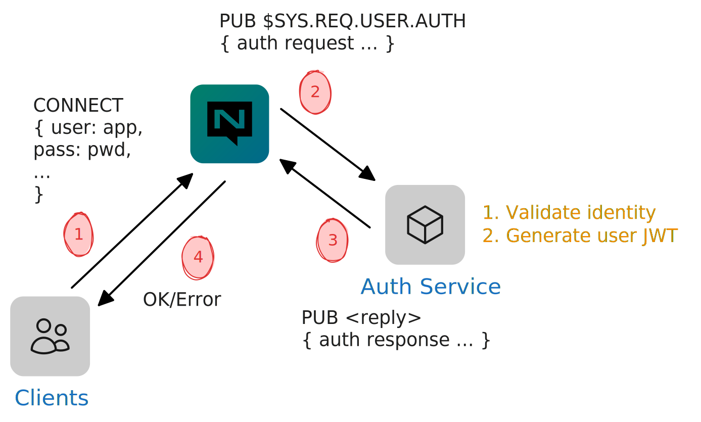

# Auth Callout

_As of NATS v2.10.0_

Auth Callout is an opt-in extension for delegating client authentication and authorization to an application-defined NATS service.

The motivation for this extension is to support applications using an alternate identity and access management (IAM) backend as the source of truth for managing users/applications/machines credentials and permissions. This could be services that implement standard protocols such as LDAP, SAML, and OAuth, an ad-hoc database, or even a file on disk.



Both centralized and decentralized authentication models are supported with slightly different considerations and semantics.

There are three phases to leveraging auth callout:

- service implementation
- migration considerations
- setup and configuration


Note, the setup and configuration is deliberately _last_ since enabling the configuration before deploying a service could cause issues for existing systems.


## Centralized Auth

Centralized auth refers to all authentication and authorization mechanisms that are server config file-based.

### Service implementation

Refer to the [end-to-end example](https://natsbyexample.com/examples/auth/callout/cli) to get oriented with a basic service implementation.

There are three key data structures:

- [authorization request claims](#authorization-request-claims)
- [authorization response claims](#authorization-response-claims)
- [user claims](#user-claims)


Language support for these structures currently exists for Go in the [nats-io/jwt](https://pkg.go.dev/github.com/nats-io/jwt/v2) package.


### Migration considerations

In this context, migration refers to the considerations and steps required to enable auth callout for an existing system without causing interruption.

In the centralized model, existing users defined in the config file will be ignored. The auth service will need to handle authenticating all users as well as assigning the target account and permissions. This includes the system account user(s) and an implicit "no auth" user.

As a result, prior to enabling auth callout, existing users and permissions must be ported to the target backend. Once the service is deployed, the `auth_callout` configuration can be enabled at which point client authentication will be delegated to the auth service. Assuming the credentials are the same, clients should not experience interruption on reconnect.

### Setup and configuration

For centralized auth callout, configuration is declared in the `auth_callout` block under the top-level `authorization` block.

```
authorization {
  auth_callout {
    ...
  }
}
```

The available properties in the `auth_callout` block include:

| Property     | Description                                                                                                       |
| :----------- | :---------------------------------------------------------------------------------------------------------------- |
| `issuer`     | The public key of the designated NKey used for signing authorization payloads.                                    |
| `auth_users` | The list of user names under `account` that are designated auth callout users.                                    |
| `account`    | The account containing the users that are designated _auth callout_ users. Defaults to the global account (`$G`). |
| `xkey`       | Optional. The public key of a designated XKey (x25519) used for encrypting authorization payloads.                |

To generate the account issuer NKey, the [nsc](https://github.com/nats-io/nsc) tool can be used.

```
$ nsc generate nkey --account
SAANDLKMXL6CUS3CP52WIXBEDN6YJ545GDKC65U5JZPPV6WH6ESWUA6YAI
ABJHLOVMPA4CI6R5KLNGOB4GSLNIY7IOUPAJC4YFNDLQVIOBYQGUWVLA
```


☝️ Be sure to generate your own keypair! Don't use this in production.


```
authorization {
  users: [ { user: auth, password: auth } ]
  auth_callout {
    issuer: ABJHLOVMPA4CI6R5KLNGOB4GSLNIY7IOUPAJC4YFNDLQVIOBYQGUWVLA
    auth_users: [ auth ]
  }
}
```

This minimum configuration would use the implicit default account `$G`.

#### Multiple accounts

If an existing system using multiple accounts is being migrated to auth callout, then the existing `accounts` configuration should remain with the `users` property removed (since it will no longer be used after being ported).

For new setups, it is recommended to use explicit accounts, such as the following configuration having the `AUTH` account for auth callout, `APP` (could be more) for application account (instead of relying on the `$G` account), and `SYS` for the system account.

```
accounts {
  AUTH: {
    users: [ { user: auth, password: auth } ]
  }
  APP: {}
  SYS: {}
}
system_account: SYS

authorization {
  auth_callout {
    issuer: ABJHLOVMPA4CI6R5KLNGOB4GSLNIY7IOUPAJC4YFNDLQVIOBYQGUWVLA
    auth_users: [ auth ]
    account: AUTH
  }
}
```

#### Encryption

The `xkey` property enables encrypting the request payloads. This is recommended as a security best practice, but not required.

To generate an XKey, `nsc` can be used again.

```
$ nsc generate nkey --curve
SXANPB47UINQR7EXT3BRP26A4LY2CMCDLTY2KX6BU3EGK2VZYREJ4IJRCE
XAMHJVPKHHPYZQQM2IVWXKJH36KDDZZMSJ32QKSQBUODFX4I4HARO4GL
```


☝️ Again, don't use this and be sure to generate your own and keep the seed secret!


Incorporating the `xkey`, we have the following config:

```
accounts {
  AUTH: {
    users: [ { user: auth, password: auth } ]
  }
  APP: {}
  SYS: {}
}
system_account: SYS

authorization {
  auth_callout {
    issuer: ABJHLOVMPA4CI6R5KLNGOB4GSLNIY7IOUPAJC4YFNDLQVIOBYQGUWVLA
    auth_users: [ auth ]
    account: AUTH
    xkey: XAMHJVPKHHPYZQQM2IVWXKJH36KDDZZMSJ32QKSQBUODFX4I4HARO4GL
  }
}
```

## Decentralized Auth

TODO

### Service implementation

Refer to the [example](https://natsbyexample.com/examples/auth/callout-decentralized/cli) showcasing configuration and a basic service implementation.

### Migration consideration

TODO

### Setup and configuration

TODO

## Reference

### Encryption

When encryption is enabled, the server will generate a one-time use XKey keypair per client connection/reconnect. The public key is included in the authorization request claims which enables the auth callout service to encrypt the authorization response payload when sending it back to the NATS server.


The one-time use keypair prevents replay attacks since the public key will be thrown away after the first response was received by the server or the timeout was reached.


Once the authorization request is prepared, it is encoded and encrypted using the configured `xkey` public key. Once encrypted, the message is published for the auth service to receive.

The auth service is expected to have the private key to decrypt the authorization request before using the claims data. When preparing the response, the server-provided one-time public xkey will be used to encrypt the response before sending back to the server.

### Schema

#### Authorization request claims

The claims is a standard JWT structure with a nested object named `nats` containing the following top-level fields:

- `server_id` - An object describing the NATS server, include the `id` field needed to be used in the authorization response.
- `user_nkey` - A user public NKey generated by the NATS server which is used as the _subject_ of the authorization response.
- `client_info` - An object describing the client attempting to connect.
- `connect_opts` - An object containing the data sent by client in the `CONNECT` message.
- `client_tls` - An object containing any client certificates, if applicable.

<details>
<summary>Full JSON schema</summary>
<pre>
{
  "$schema": "https://json-schema.org/draft/2020-12/schema",
  "$id": "authorization-request-claims",
  "properties": {
    "aud": {
      "type": "string"
    },
    "exp": {
      "type": "integer"
    },
    "jti": {
      "type": "string"
    },
    "iat": {
      "type": "integer"
    },
    "iss": {
      "type": "string"
    },
    "name": {
      "type": "string"
    },
    "nbf": {
      "type": "integer"
    },
    "sub": {
      "type": "string"
    },
    "nats": {
      "properties": {
        "server_id": {
          "properties": {
            "name": {
              "type": "string"
            },
            "host": {
              "type": "string"
            },
            "id": {
              "type": "string"
            },
            "version": {
              "type": "string"
            },
            "cluster": {
              "type": "string"
            },
            "tags": {
              "items": {
                "type": "string"
              },
              "type": "array"
            },
            "xkey": {
              "type": "string"
            }
          },
          "additionalProperties": false,
          "type": "object",
          "required": [
            "name",
            "host",
            "id"
          ]
        },
        "user_nkey": {
          "type": "string"
        },
        "client_info": {
          "properties": {
            "host": {
              "type": "string"
            },
            "id": {
              "type": "integer"
            },
            "user": {
              "type": "string"
            },
            "name": {
              "type": "string"
            },
            "tags": {
              "items": {
                "type": "string"
              },
              "type": "array"
            },
            "name_tag": {
              "type": "string"
            },
            "kind": {
              "type": "string"
            },
            "type": {
              "type": "string"
            },
            "mqtt_id": {
              "type": "string"
            },
            "nonce": {
              "type": "string"
            }
          },
          "additionalProperties": false,
          "type": "object"
        },
        "connect_opts": {
          "properties": {
            "jwt": {
              "type": "string"
            },
            "nkey": {
              "type": "string"
            },
            "sig": {
              "type": "string"
            },
            "auth_token": {
              "type": "string"
            },
            "user": {
              "type": "string"
            },
            "pass": {
              "type": "string"
            },
            "name": {
              "type": "string"
            },
            "lang": {
              "type": "string"
            },
            "version": {
              "type": "string"
            },
            "protocol": {
              "type": "integer"
            }
          },
          "additionalProperties": false,
          "type": "object",
          "required": [
            "protocol"
          ]
        },
        "client_tls": {
          "properties": {
            "version": {
              "type": "string"
            },
            "cipher": {
              "type": "string"
            },
            "certs": {
              "items": {
                "type": "string"
              },
              "type": "array"
            },
            "verified_chains": {
              "items": {
                "items": {
                  "type": "string"
                },
                "type": "array"
              },
              "type": "array"
            }
          },
          "additionalProperties": false,
          "type": "object"
        },
        "request_nonce": {
          "type": "string"
        },
        "tags": {
          "items": {
            "type": "string"
          },
          "type": "array"
        },
        "type": {
          "type": "string"
        },
        "version": {
          "type": "integer"
        }
      },
      "additionalProperties": false,
      "type": "object",
      "required": [
        "server_id",
        "user_nkey",
        "client_info",
        "connect_opts"
      ]
    }
  },
  "additionalProperties": false,
  "type": "object",
  "required": [
    "nats"
  ]
}
</pre>
</details>

#### Authorization response claims

The claims is a standard JWT structure with a nested object named `nats` containing the following top-level fields:

- `jwt` - The encoded [user claims](#user-claims) JWT which will be used by the NATS server for the duration of the client connection.
- `error` - An error message sent back to the NATS server if authorization failed. This will be included log output.
- `issuer_account` - The public Nkey of the issuing account. If set, this indicates the claim was issued by a signing key.

<details>
<summary>Full JSON schema</summary>
<pre>
{
  "$schema": "https://json-schema.org/draft/2020-12/schema",
  "$id": "https://github.com/nats-io/jwt/v2/authorization-response-claims",
  "properties": {
    "aud": {
      "type": "string"
    },
    "exp": {
      "type": "integer"
    },
    "jti": {
      "type": "string"
    },
    "iat": {
      "type": "integer"
    },
    "iss": {
      "type": "string"
    },
    "name": {
      "type": "string"
    },
    "nbf": {
      "type": "integer"
    },
    "sub": {
      "type": "string"
    },
    "nats": {
      "properties": {
        "jwt": {
          "type": "string"
        },
        "error": {
          "type": "string"
        },
        "issuer_account": {
          "type": "string"
        },
        "tags": {
          "items": {
            "type": "string"
          },
          "type": "array"
        },
        "type": {
          "type": "string"
        },
        "version": {
          "type": "integer"
        }
      },
      "additionalProperties": false,
      "type": "object"
    }
  },
  "additionalProperties": false,
  "type": "object",
  "required": [
    "nats"
  ]
}
</pre>
</details>

#### User claims

The claims is a standard JWT structure with a nested object named `nats` containing the following, notable, top-level fields:

- `issuer_account` - The public Nkey of the issuing account. If set, this indicates the claim was issued by a signing key.

<details>
<summary>Full JSON schema</summary>
<pre>
{
  "$schema": "https://json-schema.org/draft/2020-12/schema",
  "$id": "https://github.com/nats-io/jwt/v2/user-claims",
  "properties": {
    "aud": {
      "type": "string"
    },
    "exp": {
      "type": "integer"
    },
    "jti": {
      "type": "string"
    },
    "iat": {
      "type": "integer"
    },
    "iss": {
      "type": "string"
    },
    "name": {
      "type": "string"
    },
    "nbf": {
      "type": "integer"
    },
    "sub": {
      "type": "string"
    },
    "nats": {
      "properties": {
        "pub": {
          "properties": {
            "allow": {
              "items": {
                "type": "string"
              },
              "type": "array"
            },
            "deny": {
              "items": {
                "type": "string"
              },
              "type": "array"
            }
          },
          "additionalProperties": false,
          "type": "object"
        },
        "sub": {
          "properties": {
            "allow": {
              "items": {
                "type": "string"
              },
              "type": "array"
            },
            "deny": {
              "items": {
                "type": "string"
              },
              "type": "array"
            }
          },
          "additionalProperties": false,
          "type": "object"
        },
        "resp": {
          "properties": {
            "max": {
              "type": "integer"
            },
            "ttl": {
              "type": "integer"
            }
          },
          "additionalProperties": false,
          "type": "object",
          "required": [
            "max",
            "ttl"
          ]
        },
        "src": {
          "items": {
            "type": "string"
          },
          "type": "array"
        },
        "times": {
          "items": {
            "properties": {
              "start": {
                "type": "string"
              },
              "end": {
                "type": "string"
              }
            },
            "additionalProperties": false,
            "type": "object"
          },
          "type": "array"
        },
        "times_location": {
          "type": "string"
        },
        "subs": {
          "type": "integer"
        },
        "data": {
          "type": "integer"
        },
        "payload": {
          "type": "integer"
        },
        "bearer_token": {
          "type": "boolean"
        },
        "allowed_connection_types": {
          "items": {
            "type": "string"
          },
          "type": "array"
        },
        "issuer_account": {
          "type": "string"
        },
        "tags": {
          "items": {
            "type": "string"
          },
          "type": "array"
        },
        "type": {
          "type": "string"
        },
        "version": {
          "type": "integer"
        }
      },
      "additionalProperties": false,
      "type": "object"
    }
  },
  "additionalProperties": false,
  "type": "object"
}
</pre>
</details>
