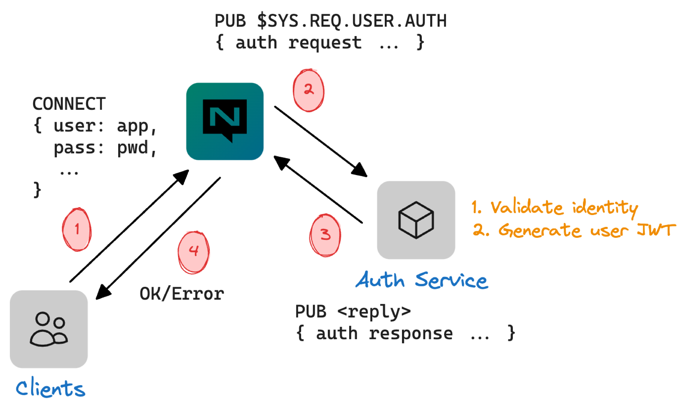

# Auth Callout

_Начиная с NATS v2.10.0_

Auth Callout — это опциональное расширение для делегирования аутентификации и авторизации клиентов в пользовательский NATS‑сервис.

Мотивация — поддержать приложения, которые используют альтернативный backend управления идентификацией и доступом (IAM) как источник истины для управления учетными данными и правами пользователей/приложений/машин. Это могут быть сервисы, реализующие стандартные протоколы вроде LDAP, SAML и OAuth, ad‑hoc база данных или даже файл на диске.

<figure><figcaption><p>Auth Callout</p></figcaption></figure>

Поддерживаются как централизованная, так и децентрализованная модели аутентификации, с немного разными требованиями и семантикой.

Есть три этапа использования auth callout:

* реализация сервиса
* вопросы миграции
* настройка и конфигурация


Обратите внимание: настройка и конфигурация намеренно идут _последними_, потому что включение конфигурации до разворачивания сервиса может вызвать проблемы в существующих системах.


## Централизованная аутентификация

Централизованная аутентификация относится ко всем механизмам аутентификации и авторизации, основанным на конфигурации сервера.

### Реализация сервиса

См. [end‑to‑end пример](https://natsbyexample.com/examples/auth/callout/cli), чтобы понять базовую реализацию сервиса.

Есть три ключевые структуры данных:

* [authorization request claims](auth_callout.md#authorization-request-claims)
* [authorization response claims](auth_callout.md#authorization-response-claims)
* [user claims](auth_callout.md#user-claims)


Поддержка этих структур на данный момент есть для Go в пакете [nats-io/jwt](https://pkg.go.dev/github.com/nats-io/jwt/v2).


### Вопросы миграции

В этом контексте миграция — это соображения и шаги, необходимые для включения auth callout в существующей системе без прерываний.

В централизованной модели существующие пользователи, определенные в конфиге, будут игнорироваться. Auth‑сервис должен будет аутентифицировать всех пользователей и назначать целевой аккаунт и permissions. Это включает пользователей системного аккаунта и неявного пользователя "no auth".

В результате, до включения auth callout, существующих пользователей и права нужно перенести в целевой backend. После развертывания сервиса можно включить `auth_callout` — и аутентификация клиентов будет делегирована auth‑сервису. При условии, что учетные данные те же, клиенты не должны испытывать прерываний при переподключении.

### Настройка и конфигурация

Для централизованного auth callout конфигурация задается в блоке `auth_callout` внутри верхнеуровневого блока `authorization`.

```
authorization {
  auth_callout {
    ...
  }
}
```

Доступные свойства блока `auth_callout`:

| Свойство     | Описание                                                                                                       |
| ------------ | ------------------------------------------------------------------------------------------------------------- |
| `issuer`     | Публичный ключ выделенного NKey, используемого для подписи payload’ов авторизации.                            |
| `auth_users` | Список имен пользователей или nkeys под `account`, которые являются auth callout users.                      |
| `account`    | Аккаунт, содержащий пользователей, назначенных _auth callout_ users. По умолчанию глобальный аккаунт (`$G`). |
| `xkey`       | Опционально. Публичный ключ выделенного XKey (x25519) для шифрования payload’ов авторизации.                |

Для генерации account issuer NKey можно использовать инструмент [nsc](https://github.com/nats-io/nsc).

```
$ nsc generate nkey --account
SAANDLKMXL6CUS3CP52WIXBEDN6YJ545GDKC65U5JZPPV6WH6ESWUA6YAI
ABJHLOVMPA4CI6R5KLNGOB4GSLNIY7IOUPAJC4YFNDLQVIOBYQGUWVLA
```


☝️ Обязательно генерируйте собственную пару ключей! Не используйте это в продакшне.


```
authorization {
  users: [ { user: auth, password: auth } ]
  auth_callout {
    issuer: ABJHLOVMPA4CI6R5KLNGOB4GSLNIY7IOUPAJC4YFNDLQVIOBYQGUWVLA
    auth_users: [ auth ]
  }
}
```

Эта минимальная конфигурация использует неявный аккаунт по умолчанию `$G`.

#### Несколько аккаунтов

Если существующая система с несколькими аккаунтами мигрирует на auth callout, то текущая конфигурация `accounts` должна быть сохранена, но свойство `users` удалено (так как оно больше не будет использоваться после переноса).

Для новых установок рекомендуется явно использовать аккаунты, например следующую конфигурацию с аккаунтом `AUTH` для auth callout, `APP` (может быть больше) для приложений (вместо `$G`) и `SYS` для системного аккаунта.

```
accounts {
  AUTH: {
    users: [ { user: auth, password: auth } ]
  }
  APP: {}
  SYS: {}
}
system_account: SYS

authorization {
  auth_callout {
    issuer: ABJHLOVMPA4CI6R5KLNGOB4GSLNIY7IOUPAJC4YFNDLQVIOBYQGUWVLA
    auth_users: [ auth ]
    account: AUTH
  }
}
```

#### Шифрование

Свойство `xkey` включает шифрование payload’ов запросов. Это рекомендуется как best practice, но не обязательно.

Чтобы сгенерировать XKey, можно снова использовать `nsc`.

```
$ nsc generate nkey --curve
SXANPB47UINQR7EXT3BRP26A4LY2CMCDLTY2KX6BU3EGK2VZYREJ4IJRCE
XAMHJVPKHHPYZQQM2IVWXKJH36KDDZZMSJ32QKSQBUODFX4I4HARO4GL
```


☝️ Снова: не используйте это и обязательно генерируйте свои ключи и держите seed в секрете!


С учетом `xkey` конфигурация будет такой:

```
accounts {
  AUTH: {
    users: [ { user: auth, password: auth } ]
  }
  APP: {}
  SYS: {}
}
system_account: SYS

authorization {
  auth_callout {
    issuer: ABJHLOVMPA4CI6R5KLNGOB4GSLNIY7IOUPAJC4YFNDLQVIOBYQGUWVLA
    auth_users: [ auth ]
    account: AUTH
    xkey: XAMHJVPKHHPYZQQM2IVWXKJH36KDDZZMSJ32QKSQBUODFX4I4HARO4GL
  }
}
```

## Децентрализованная аутентификация

Скоро!

## Справка

### Шифрование

Когда шифрование включено, сервер будет генерировать одноразовую пару ключей XKey на каждое подключение/переподключение клиента. Публичный ключ включается в authorization request claims, что позволяет сервису auth callout шифровать payload ответа при отправке обратно на сервер NATS.


Одноразовая пара ключей предотвращает атаки повторного воспроизведения, так как публичный ключ выбрасывается после получения первого ответа сервером или по истечении таймаута.


После подготовки запроса авторизации он кодируется и шифруется с использованием публичного ключа `xkey` из конфигурации. После шифрования сообщение публикуется, чтобы auth‑сервис мог его получить.

Auth‑сервис должен иметь приватный ключ для расшифровки запроса перед использованием данных claims. При подготовке ответа предоставленный сервером одноразовый публичный xkey будет использоваться для шифрования ответа перед отправкой обратно на сервер.

### Схема

#### Authorization request claims

Claims — это стандартная структура JWT с вложенным объектом `nats`, содержащим следующие верхнеуровневые поля:

* `server_id` — объект, описывающий NATS‑сервер, включая поле `id`, которое нужно использовать в authorization response.
* `user_nkey` — публичный NKey пользователя, генерируемый сервером NATS и используемый как _subject_ authorization response.
* `client_info` — объект, описывающий клиента, пытающегося подключиться.
* `connect_opts` — объект, содержащий данные, отправленные клиентом в сообщении `CONNECT`.
* `client_tls` — объект, содержащий клиентские сертификаты (если применимо).

<details>

<summary>Полная JSON‑схема</summary>

```
{
  "$schema": "https://json-schema.org/draft/2020-12/schema",
  "$id": "authorization-request-claims",
  "properties": {
    "aud": {
      "type": "string"
    },
    "exp": {
      "type": "integer"
    },
    "jti": {
      "type": "string"
    },
    "iat": {
      "type": "integer"
    },
    "iss": {
      "type": "string"
    },
    "name": {
      "type": "string"
    },
    "nbf": {
      "type": "integer"
    },
    "sub": {
      "type": "string"
    },
    "nats": {
      "properties": {
        "server_id": {
          "properties": {
            "name": {
              "type": "string"
            },
            "host": {
              "type": "string"
            },
            "id": {
              "type": "string"
            },
            "version": {
              "type": "string"
            },
            "cluster": {
              "type": "string"
            },
            "tags": {
              "items": {
                "type": "string"
              },
              "type": "array"
            },
            "xkey": {
              "type": "string"
            }
          },
          "additionalProperties": false,
          "type": "object",
          "required": [
            "name",
            "host",
            "id"
          ]
        },
        "user_nkey": {
          "type": "string"
        },
        "client_info": {
          "type": "object"
        },
        "connect_opts": {
          "type": "object"
        },
        "client_tls": {
          "type": "object"
        }
      },
      "additionalProperties": false,
      "type": "object",
      "required": [
        "server_id",
        "user_nkey"
      ]
    }
  },
  "additionalProperties": false,
  "type": "object",
  "required": [
    "aud",
    "exp",
    "jti",
    "iat",
    "iss",
    "sub",
    "nats"
  ]
}
```

</details>

#### Authorization response claims

Claims — стандартная структура JWT с вложенным объектом `nats`, содержащим следующие ключевые поля верхнего уровня:

* `jwt` — закодированный JWT [user claims](auth_callout.md#user-claims), который будет использоваться сервером NATS на протяжении клиентского соединения.
* `error` — сообщение об ошибке, отправляемое серверу NATS при неуспешной авторизации. Оно будет включено в логи.
* `issuer_account` — публичный Nkey аккаунта‑эмитента. Если задано, это означает, что claim был выпущен signing key.

<details>

<summary>Полная JSON‑схема</summary>

```
{
  "$schema": "https://json-schema.org/draft/2020-12/schema",
  "$id": "https://github.com/nats-io/jwt/v2/authorization-response-claims",
  "properties": {
    "aud": {
      "type": "string"
    },
    "exp": {
      "type": "integer"
    },
    "jti": {
      "type": "string"
    },
    "iat": {
      "type": "integer"
    },
    "iss": {
      "type": "string"
    },
    "name": {
      "type": "string"
    },
    "nbf": {
      "type": "integer"
    },
    "sub": {
      "type": "string"
    },
    "nats": {
      "properties": {
        "jwt": {
          "type": "string"
        },
        "error": {
          "type": "string"
        },
        "issuer_account": {
          "type": "string"
        },
        "tags": {
          "items": {
            "type": "string"
          },
          "type": "array"
        },
        "type": {
          "type": "string"
        },
        "version": {
          "type": "integer"
        }
      },
      "additionalProperties": false,
      "type": "object"
    }
  },
  "additionalProperties": false,
  "type": "object",
  "required": [
    "nats"
  ]
}
```

</details>

#### User claims

Claims — стандартная структура JWT с вложенным объектом `nats`, содержащим следующие заметные поля верхнего уровня:

* `issuer_account` — публичный Nkey аккаунта‑эмитента. Если задано, это означает, что claim был выпущен signing key.

<details>

<summary>Полная JSON‑схема</summary>

```
{
  "$schema": "https://json-schema.org/draft/2020-12/schema",
  "$id": "https://github.com/nats-io/jwt/v2/user-claims",
  "properties": {
    "aud": {
      "type": "string"
    },
    "exp": {
      "type": "integer"
    },
    "jti": {
      "type": "string"
    },
    "iat": {
      "type": "integer"
    },
    "iss": {
      "type": "string"
    },
    "name": {
      "type": "string"
    },
    "nbf": {
      "type": "integer"
    },
    "sub": {
      "type": "string"
    },
    "nats": {
      "properties": {
        "pub": {
          "properties": {
            "allow": {
              "items": {
                "type": "string"
              },
              "type": "array"
            },
            "deny": {
              "items": {
                "type": "string"
              },
              "type": "array"
            }
          },
          "additionalProperties": false,
          "type": "object"
        },
        "sub": {
          "properties": {
            "allow": {
              "items": {
                "type": "string"
              },
              "type": "array"
            },
            "deny": {
              "items": {
                "type": "string"
              },
              "type": "array"
            }
          },
          "additionalProperties": false,
          "type": "object"
        },
        "resp": {
          "properties": {
            "max": {
              "type": "integer"
            },
            "ttl": {
              "type": "integer"
            }
          },
          "additionalProperties": false,
          "type": "object",
          "required": [
            "max",
            "ttl"
          ]
        },
        "src": {
          "items": {
            "type": "string"
          },
          "type": "array"
        },
        "times": {
          "items": {
            "properties": {
              "start": {
                "type": "string"
              },
              "end": {
                "type": "string"
              }
            },
            "additionalProperties": false,
            "type": "object"
          },
          "type": "array"
        },
        "times_location": {
          "type": "string"
        },
        "subs": {
          "type": "integer"
        },
        "data": {
          "type": "integer"
        },
        "payload": {
          "type": "integer"
        },
        "bearer_token": {
          "type": "boolean"
        },
        "allowed_connection_types": {
          "items": {
            "type": "string"
          },
          "type": "array"
        },
        "issuer_account": {
          "type": "string"
        },
        "tags": {
          "items": {
            "type": "string"
          },
          "type": "array"
        },
        "type": {
          "type": "string"
        },
        "version": {
          "type": "integer"
        }
      },
      "additionalProperties": false,
      "type": "object"
    }
  },
  "additionalProperties": false,
  "type": "object"
}
```

</details>
