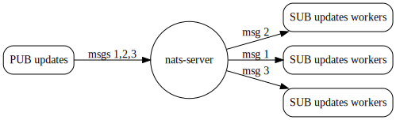

# Подписки очереди

Подписка на [queue group](../../../nats-concepts/core-nats/queue-groups/queue.md) лишь немного отличается от подписки на один subject. Приложение просто указывает имя очереди вместе с подпиской. Сервер будет балансировать нагрузку между всеми участниками queue group. В кластерной конфигурации каждый участник имеет одинаковый шанс получить конкретное сообщение.

Имейте в виду, что queue group в NATS динамические и не требуют конфигурации сервера.



Например, чтобы подписаться на очередь `workers` с subject `updates`:



```go
nc, err := nats.Connect("demo.nats.io")
if err != nil {
    log.Fatal(err)
}
defer nc.Close()

// Use a WaitGroup to wait for 10 messages to arrive
wg := sync.WaitGroup{}
wg.Add(10)

// Create a queue subscription on "updates" with queue name "workers"
if _, err := nc.QueueSubscribe("updates", "workers", func(m *nats.Msg) {
    wg.Done()
}); err != nil {
    log.Fatal(err)
}

// Wait for messages to come in
wg.Wait()
```



```java
Connection nc = Nats.connect("nats://demo.nats.io:4222");

// Use a latch to wait for 10 messages to arrive
CountDownLatch latch = new CountDownLatch(10);

// Create a dispatcher and inline message handler
Dispatcher d = nc.createDispatcher((msg) -> {
    String str = new String(msg.getData(), StandardCharsets.UTF_8);
    System.out.println(str);
    latch.countDown();
});

// Subscribe to the "updates" subject with a queue group named "workers"
d.subscribe("updates", "workers");

// Wait for a message to come in
latch.await(); 

// Close the connection
nc.close();
```



```javascript
nc.subscribe(subj, {
    queue: "workers",
    callback: (_err, _msg) => {
      t.log("worker1 got message");
    },
});

nc.subscribe(subj, {
    queue: "workers",
    callback: (_err, _msg) => {
      t.log("worker2 got message");
    },
});
```



```python
nc = NATS()

await nc.connect(servers=["nats://demo.nats.io:4222"])

future = asyncio.Future()

async def cb(msg):
  nonlocal future
  future.set_result(msg)

await nc.subscribe("updates", queue="workers", cb=cb)
await nc.publish("updates", b'All is Well')

msg = await asyncio.wait_for(future, 1)
print("Msg", msg)
```



```csharp
// dotnet add package NATS.Net
using NATS.Net;

await using var client = new NatsClient();

var count = 0;

// Subscribe to the "updates" subject with a queue group named "workers"
await foreach (var msg in client.SubscribeAsync<string>(subject: "updates", queueGroup: "workers"))
{
    Console.WriteLine($"Received {++count}: {msg.Subject}: {msg.Data}");
    
    // Break after 10 messages
    if (count == 10)
    {
        break;
    }
}

Console.WriteLine("Done");
```



```ruby
require 'nats/client'
require 'fiber'

NATS.start(servers:["nats://127.0.0.1:4222"]) do |nc|
  Fiber.new do
    f = Fiber.current

    nc.subscribe("updates", queue: "worker") do |msg, reply|
      f.resume Time.now
    end

    nc.publish("updates", "A")

    # Use the response
    msg = Fiber.yield
    puts "Msg: #{msg}"
  end.resume
end
```



```c
static void
onMsg(natsConnection *conn, natsSubscription *sub, natsMsg *msg, void *closure)
{
    printf("Received msg: %s - %.*s\n",
           natsMsg_GetSubject(msg),
           natsMsg_GetDataLength(msg),
           natsMsg_GetData(msg));

    // Need to destroy the message!
    natsMsg_Destroy(msg);
}


(...)

natsConnection      *conn = NULL;
natsSubscription    *sub  = NULL;
natsStatus          s;

s = natsConnection_ConnectTo(&conn, NATS_DEFAULT_URL);

// Create a queue subscription on "updates" with queue name "workers"
if (s == NATS_OK)
    s = natsConnection_QueueSubscribe(&sub, conn, "updates", "workers", onMsg, NULL);

(...)


// Destroy objects that were created
natsSubscription_Destroy(sub);
natsConnection_Destroy(conn);
```



Если запустить этот пример вместе с примерами публикации, которые отправляют в `updates`, вы увидите, что сообщение получит один из экземпляров, а остальные — нет. Но экземпляр, который получит сообщение, будет меняться.
