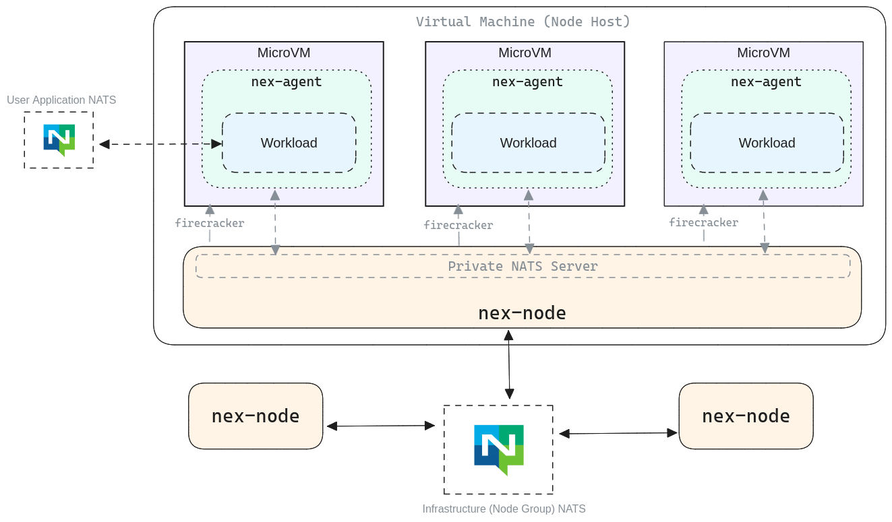

# 架构概述

尽管 Nex 的绝大部分功能都包含在单个 `nex` 二进制文件中，但 Nex 实际上是一套工具和组件的集合，它们共同协作，使您能够利用现有的 NATS 基础设施部署和管理工作负载。

## 架构概述

下图展示了 Nex 系统架构以及各个组件之间的交互方式。乍一看可能有些复杂，因此接下来我们将详细解释图表中的每个部分。

## 工作负载 NATS 与 控制 NATS

在讨论各个组件之前，我们首先需要提供一些背景信息。理解一个非常重要的概念至关重要，即工作负载使用的 NATS 系统与 Nex 使用的 NATS 系统之间的区别。为了正确且安全地配置生产环境中的系统，你必须充分理解这一点。

### 工作负载用的 NATS

工作负载使用的连接仅用于工作负载本身。如果您正在将现有服务部署到 Nex 中，那么您会知道这些工作负载需要亲自连接上 NATS ，并且根据应用程序的不同，通常会有非常具体的连接和安全要求。

在大多数此类应用程序中（尤其是那些遵循 [12 因素应用](https://12factor.net/config) 指南的应用程序），您的代码通过环境变量获取连接数据。例如，它可能会从 `NATS_SERVER` 环境变量中获取服务器 URL。

无论代码是在 Nex 内部还是外部运行，这种连接始终保持不变。

对于服务而言，情况相对简单，因为它们依赖于环境变量，并且最重要的是，允许他们创建自己的与 NATS 服务器的连接（在 CNI 配置的约束范围内）。

函数则在连接 NATS 方面扮演更被动的角色。它们不会创建自己的 NATS 连接，而是依赖于 Nex 节点提供的 [宿主服务](../host_services/) 来与有限的 NATS 资源（如键值存储、对象存储桶和发布主题）进行通信。这种连接也由工作负载部署的初始化参数决定。

### 控制用的 NATS

所有的 Nex 节点都可以被远程控制。这是我们之前多次提到的命令式控制的关键所在。当一个 Nex 节点启动时，它需要连接上 NATS。这个连接专门用于命令和控制操作。因此，在规划账户、签名密钥和操作员的结构时，您应该牢记这一点。尽管 Nex 的安全性很高，但您仍然不希望不受信任的代码拥有对 控制用 NATS 连接 的无限制访问权限。

所有控制操作都在以 `$NEX` 为前缀的主题命名空间中进行，这使得隔离和控制访问变得容易。


除非您在测试或开发环境中运行，否则工作负载使用的连接不应与控制接口使用的连接重叠。您不一定需要专用的服务器，但应确保流量隔离。
   

## Nex 组件

在前面的图表中包含了许多关键的 Nex 组件，本节将详细讨论每个组件。

* [节点进程](node_process.md)
* [Nex 代理](agent.md)
* [根文件系统](rootfs.md)
* [控制接口](control_interface.md)

## 内部（隐藏）NATS

在上图中还有一种 NATS 连接，我们认为最好将其留到讨论的最后，以避免不必要的混淆。这是 Nex 节点和代理之间用于通信的 _内部 NATS_ 连接。

此连接既不会被应用程序代码使用，也不会被远程控制代码使用。它仅在内部使用，并且仅绑定到本地设备可用的 IP 地址。换句话说，即使您想远程使用此 NATS 连接，也不应该能够做到。

在大多数情况下，除非您正在贡献代码的这一部分，否则忽略此连接可能是最简单的方案。